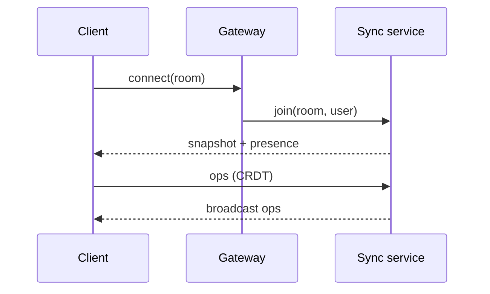

# Architecture

```mermaid
sequenceDiagram
  participant C as Client
  participant G as Gateway
  participant S as Sync service
  C->>G: connect(room)
  G->>S: join(room, user)
  S-->>C: snapshot + presence
  C->>S: ops (CRDT)
  S-->>C: broadcast ops
```
